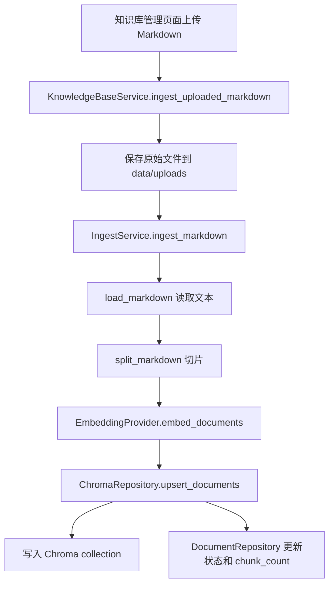
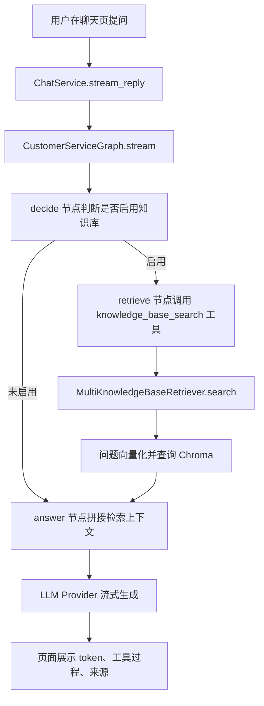

# AI/RAG 修改入口说明

这份文档用于快速定位项目里和 AI 相关的核心操作：切片、Embedding、向量数据库、检索、Agent 编排和回答生成。

## 1. 最常改的入口

| 目标 | 优先修改位置 | 说明 |
| --- | --- | --- |
| 调整切片大小、重叠长度、检索数量 | `service.env`，`src/config/settings.py` | `CHUNK_SIZE`、`CHUNK_OVERLAP`、`DEFAULT_TOP_K` 从环境变量读取。 |
| 修改切片算法 | `src/rag/splitters/markdown_splitter.py` | 当前按 Markdown 标题分段，再按字符窗口切片。 |
| 修改入库流程 | `src/rag/ingestion/ingest_service.py` | 上传文档读取、切片、向量化、写入 Chroma 都在这里串起来。 |
| 修改 Embedding 模型 | `src/rag/embeddings/openai_embedding.py`，`src/bootstrap/container.py` | 当前支持 OpenAI Embedding 和本地 simple 演示向量。 |
| 替换向量数据库 | `src/repositories/chroma_repository.py` | 建议保持 `upsert_documents`、`query` 方法签名不变，只替换内部实现。 |
| 调整多知识库检索逻辑 | `src/rag/retrievers/multi_kb_retriever.py` | 控制 query embedding、逐知识库查询、score 排序和结果合并。 |
| 调整 Agent 调用工具和上下文拼接 | `src/agent/graph.py` | LangGraph 节点、检索工具调用、RAG prompt 拼接都在这里。 |
| 修改模型供应商 | `src/llm/factory.py`，`src/llm/*_provider.py` | OpenAI、Ollama、Xinference 的流式输出封装在这里。 |

## 2. 上传入库流程

## 3. 检索和问答流程

## 4. 配置影响范围

| 配置 | 默认值 | 影响 |
| --- | --- | --- |
| `EMBEDDING_PROVIDER` | `openai` | 决定入库和检索使用哪个向量化实现。 |
| `OPENAI_EMBEDDING_MODEL` | `text-embedding-3-small` | OpenAI Embedding 模型名。 |
| `CHUNK_SIZE` | `1200` | 每个切片的最大字符数。过大会降低精确召回，过小会丢上下文。 |
| `CHUNK_OVERLAP` | `200` | 相邻切片重叠字符数。用于减少跨段信息丢失。 |
| `DEFAULT_TOP_K` | `6` | 每个知识库默认召回片段数。多知识库时会先分别召回再合并排序。 |

修改 `CHUNK_SIZE`、`CHUNK_OVERLAP`、`EMBEDDING_PROVIDER` 后，旧文档不会自动重新切片或重新向量化。要让旧文档使用新策略，需要重新上传入库，或后续增加“重建知识库”功能。

## 5. 推荐扩展顺序

1. 先改 `service.env` 调整 `CHUNK_SIZE`、`CHUNK_OVERLAP`、`DEFAULT_TOP_K`，验证召回质量。
2. 如果召回仍不准，改 `src/rag/splitters/markdown_splitter.py`，从字符切片升级为按标题、段落、列表、QA 块混合切片。
3. 如果上下文命中了但排序不好，改 `src/rag/retrievers/multi_kb_retriever.py`，增加 rerank、score 阈值或关键词过滤。
4. 如果要替换 Chroma，改 `src/repositories/chroma_repository.py`，保持上层接口不变。
5. 如果要让 Agent 更智能，改 `src/agent/graph.py`，增加查询改写、二次检索、无结果兜底、引用格式控制。
